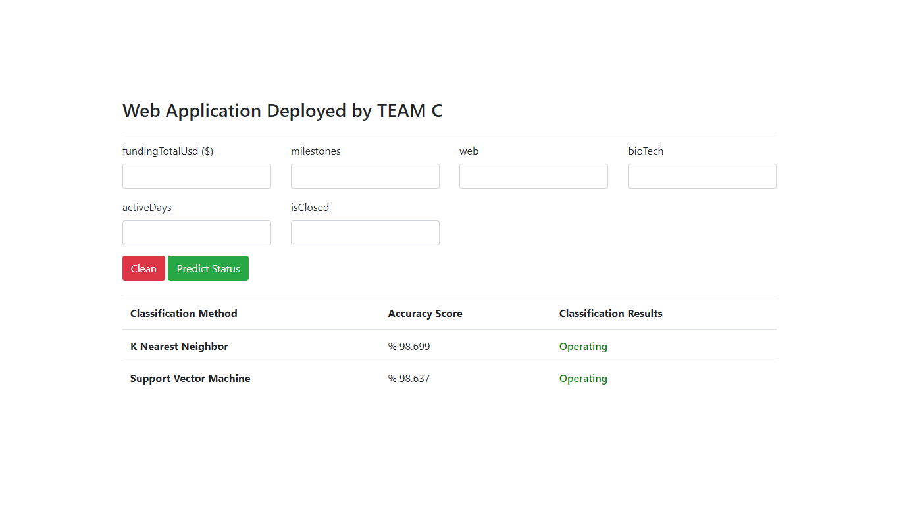

# Flask-Heroku-WebApp

In this project we aim to predict the status of the startup

--- 
## Understanding the Dataset
The dataset we are working on is a combination of numerical and categorical data which describes the startup 

- The dataset contains features of the startup, such as: *fundingTotalUsd, milestones, web, bioTech, activeDays and isClosed*

- Labels of the dataset are related to the startup's current status which can be `operating` , `closed` , `acquired` or `ipo`

---
## Preprocessing  

### Data Cleaning  
**1. Deleting irrelevant features and duplicate values:**

After proper inspection of the dataset, we selected the irrelevant features and deleted them, such as:
* `id`, `Unnamed: 0.1`, `entity_type`, `entity_id`, `parent_id`
* `region`,`city`,`state_code`, `created_by`, `created_at`, `updated_at`  
* `domain`, `homepage_url`, `twitter_username`, `logo_url`, `logo_width`, `logo_height`  
* `short_description`, `description`, `overview`,`tag_list`, `name`, `normalized_name`  
* `invested_companies`, `permalink`  
* `first_milestone_at`, `last_milestone_at`, `first_funding_at`,`last_funding_at`
  
Duplicate values provide `high bias`, therefore they have been deleted.
  
**2. Removing noise from dataset:**  
* Columns with percentage of `null values` more than `97.5%` have been dropped  
* Deleted instances with missing values for `status`, `country_code`, `category_code` and `founded_at`
* Outliers of `funding_total_usd` and `funding_rounds` have been deleted according to `IQR` *(Inter-Quantile Range)*
  
### Data Transformation  
**1. Changes in original data:**

Dates in these columns have been converted to years:
* `founded_at` and `closed_at`
  
`One-Hot Encoding` has been used to generalize categorical data in columns:
* `category_code` and `country_code`
  
**2. Creating new variables:**

Two new features(`isClosed` and `active_days`) were created based on other ones:  
* `isClosed = 1` if `status == operating` or `ipo` 
* `isClosed = 0` if `status == acquired` or `closed`
* `active_days` was calculated by using `closed_at`, `founded_at`, and `status` to define the age of the company
  
**3. Other transformations:**

* Deleted `closed_at` column
* Filled null values of the numerical features with the `mean` values of them according to their column 

Encoded `status` column:
- Replaced `operating` with `1`
- Replaced `acquired` with `2`
- Replaced `closed` with `3`
- Replaced `ipo` with `4`

---  
## Exploratory Data Analysis (`EDA`) and Feature Engineering  

### Creating new feature  
A new feature `funding_per_active_day` was added to the dataset to show the total us dollars funded per day and calculated by dividing `funding_total_usd` by `active_days`:
* `funding_per_active_day = funding_total_usd / active_days`
To escape from `ZeroDivisionError`, if `active_days == 0`, then `funding_total_usd` was assigned to `funding_per_active_day`

### Mutual information (`MI Score`)
Used `MI` to detect the most relevant features in the data.
It is more efficient than the correlation as it doesn't assume a linear relationship, instead it measures the level of uncertainty between two features:
* `isClosed` , `funding_total_usd` and `funding_per_active_day` have the highest scores
* Features that have `MI score` higher than `0.01` were selected to proceed further

### Standardization  
A function called `StandardScaler()` was used to standarize the data

### Principal Component Analysis (`PCA`)  
Standardized data was used to fit to the `PCA` so as to find the `Principal Components` contributing to the label data
`pca = PCA(n_components=2)`  

---  
## Classification Models  

In order to choose the models wisely, a few metrics were considered for the model evaluation:  
**Accuracy , Precision and Recall**  

The classifiers we used are: **Support Vector Machine (`SVM`) and K Nearest Neighbor (`KNN`)**  
### *SVM - Support Vector Machine*
SVM was tested with different kernels with the help of `GridSearchCV` to choose the best one for our dataset
* Tests showed that the best kernel was `rbf` with `degree = 3`
* The best `accuracy` of the `SVM` model was `95.5%`

### *KNN - K Nearest Neighbor*
KNN was also tested with  `GridSearchCV` to choose the best `n_neighbors` for our dataset
* Tests showed that the highest score was reached when `n_neighbors = 11`
* The best `accuracy` of the `KNN` model was `96.7%`

As a result, `KNN` performed a bit better than `SVM`
---  
## Building Pipelines  
Pipelines provide us with clear and understandable code. The process of creating a pipeline that was used goes as follows:  

* ***KNN*** &rarr; `Operating`, `Acquired`, `Closed` and `IPO`
* ***SVM*** &rarr; `Operating`, `Acquired`, `Closed` and `IPO`  

#### *SVM Pipeline*    
```python
from sklearn.pipeline import Pipeline

pipeline_svm = Pipeline(steps=[
    ('scaler1', StandardScaler()),
    ('pca1', PCA(n_components=2)),
    ('svm', SVC(kernel='rbf', 'degree'=3))
])
```  
#### *KNN Pipeline*  
```python
from sklearn.pipeline import Pipeline

pipeline_knn = Pipeline(steps=[
    ('scaler2', StandardScaler()),
    ('pca2', PCA(n_components=2)),
    ('knn', KNeighborsClassifier(n_neighbors=11))
])
```  

---  
## Model Deployment  
Our `WebApp` can be accessed through this link [startup-status-web-app](https://team-c-webapp.herokuapp.com/) 



#### Flask  
`Flask` is a framework that helps to create web applications for your models by using simple python code.  
Our `WebApp` allows the user to enter a few pieces of information about the startup of interest:  
`fundingTotalUsd`, `milestones`, `web`, `bioTech`, `activeDays`, `isClosed`.  
This `WebApp` takes the data as an input and predicts the `status` based on `KNN` and `SVM` classifiers and shows the **accuracy** and **predicted status** of each `classifier` as an output

#### Heroku  
In order to deploy our model, we used [Heroku](https://www.heroku.com/). Right now, our model is hosted online which you can access to through this link [startup-status-web-app](https://team-c-webapp.herokuapp.com/).  

---
